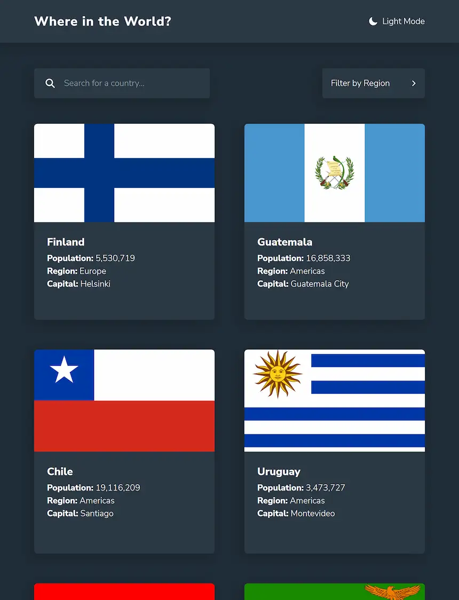

# Where in the World?

A website that allows you to search information about countries. This is a solution to the [REST Countries API with color theme switcher challenge on Frontend Mentor](https://www.frontendmentor.io/challenges/rest-countries-api-with-color-theme-switcher-5cacc469fec04111f7b848ca). Made with the [Rest Countries API](https://restcountries.com)

[Live Page][live-page]

Table of contents

- [Overview](#overview)
  - [The challenge](#the-challenge)
  - [Screenshots](#screenshots)
  - [Links](#links)
- [My process](#my-process)
  - [Built with](#built-with)
  - [What I learned](#what-i-learned)
- [Author](#author)

## Overview

### The challenge

Users should be able to:

- See all countries from the API on the homepage
- Search for a country using an `input` field
- Filter countries by region
- Click on a country to see more detailed information on a separate page
- Toggle the color scheme between light and dark mode

Additional features:

- URL path handling
- Back to top button
- Dark mode detection and saving themes to localStorage

### Screenshots

<table>
        <tr>
		    <td>
                
            </td>
			            <td>
                
            </td>
            <td>
                
            </td>
        </tr>
</table>

### Links

- [Live Page][live-page]

## My process

### Built with

- Flexbox
- CSS Grid
- [React](https://reactjs.org/)
- [Vite](https://vitejs.dev)
- [TailwindCSS](https://tailwindcss.com)
- [Rest Countries API](https://restcountries.com)

<a href="#top">⬆️ Back to top</a>

### What I learned

This challenge was a great learning opportunity. I worked on different topics that helped me improve my knowledge of technologies such as React, Tailwind, Fetch and of course JS.

I also added some new features like the theme switch button or the path handling, for the latter I initially thought to use React Router but due to some changes of ideas React Router was no longer necessary so I decided to do the path handling with vanilla JS.

<a href="#top">⬆️ Back to top</a>

[live-page]: https://where-world.vercel.app
